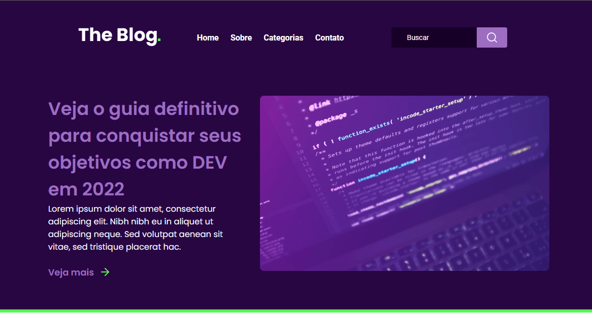

<p align="center">
  <a href="#">
    
  </a>
</p>

<h1 align="center">RocketBlog</h1>
<p align="center">🚀Desafio da Rocketseat do Curso Discover de um blog</p>

<div align="center">
  
  
  
</div>

<p align="center">
 <a href="#objetivo">Objetivo</a> •
 <a href="#tecnologias">Tecnologias</a> • 
 <a href="#pre-req">Pré-requisitos</a> • 
 <a href="#autor">Autor</a> • 
 <a href="#license">License</a>
</p>
<h4 align="center"> 
	🚧  RocketBlog 🚀 Concluído.  🚧
</h4>


<h3 id="objetivo">Objetivo 🎯</h3>

Desenvolver a homepage de um blog com foco em tecnologia. <br>

<div align="center">
  
</div>


<h3 id="pre-req">Pré-requisitos</h3>

Antes de começar, você vai precisar ter instalado em sua máquina o
[Git](https://git-scm.com). Além disto é bom ter um editor para trabalhar com o código como [VSCode](https://code.visualstudio.com/)


### 🎲 Rodando o pojeto na sua máquina

```bash
# Clone este repositório
$ git clone <https://github.com/davivsouza/rocket-blog.git>

# Acesse a pasta do projeto no terminal/cmd
$ cd rocket-blog

#Execute em modo desenvolvimento
$ npm run dev
 
# O localhost inciará na porta:3000 - acesse <http://localhost:3000>

```


<h1 id="tecnologias">🛠 Tecnologias</h1>

As seguintes ferramentas foram usadas na construção do projeto:

- [React](https://pt-br.reactjs.org/)
- [TypeScript](https://www.typescriptlang.org/)
- [Styled-components](https://styled-components.com/docs)


<h1 id="autor">Autor</h1>

<a href="https://github.com/davivsouza/">
 
 <br />
 <sub><b>Davi Souza</b></sub></a> <a href="https://github.com/davivsouza/" title="Davi V. Souza">🕊</a>


Feito com ❤️ por Davi V. Souza 👋🏽 Entre em contato!

[](https://www.linkedin.com/in/davi-vasconcelos-souza-236170234/) 
[](mailto:davivasconcelossouza21@gmail.com)

<h1 id="license">License</h1>
MIT
